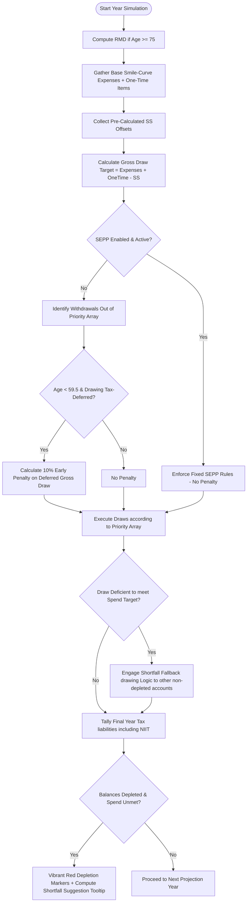

# Technical Implementation Plan - Advanced FIRE Calculator Enhancements

## 1. Technical Context & Architecture Review

- **Core Technology Stack**: Portable Client-Side Custom Web App (HTML5, Vanilla CSS3, Vanilla JavaScript, Chart.js v4, SheetJS/XLSX v0.18.5).
- **Application Architecture**: Single-file client-side application. All UI structure resides in the HTML body, all animations/styling occupy the `<style>` tag, and all simulation/sequencing engines reside in the `<script>` tag.
- **State Management**: Component input synchronization between inputs (number fields) and standard range sliders will update the global simulation control variables. The calculation engine will rerun the retirement trajectory and schedule-based calculations on every input adjustment, immediately updating both Chart.js visualizations and table DOM elements.

## 2. Proposed Data Model Enhancements

Since all data management occurs client-side, the custom state handles both baseline control data and dynamic outputs.

- **Inputs Data Structure Expansion**:
  ```javascript
  let inputs = {
    // Smile Curve spending inputs
    annualExpensesTo65: 200000,
    annualExpenses66to75: 200000,
    annualExpenses76to85: 200000,
    
    // Custom withdrawal timing & sequence
    ageStartDeferred: 59.5, // user selectable
    ageStartFree: 59.5,     // user selectable
    accountPriority: ['taxable', 'deferred', 'free'], // editable array
    
    // Expanded tax calculations
    filingStatus: 'Single', // 'Single', 'MFJ', 'MFS', 'HoH'
    
    // Automatic SEPP options
    seppEnabled: false,
    seppStartAge: 55,
    seppMethod: 'amortization', // 'amortization', 'annuitization', 'rmd'
    seppInterestRate: 0.04,
    
    // Unique large ticket items counter
    oneTimeExpenses: [
      // { id: 1, age: 60, amount: 50000, label: 'Cabin Wedding' }
    ]
  };
  ```

- **Simulation Table Projection Data Model Extensions**:
  ```javascript
  let rowProjection = {
    age: 55,
    balances: { taxable: 1000000, deferred: 800000, free: 500000, hk: 300000 },
    totalBalance: 2600000,
    expensesRequired: 200000,
    oneTimeSpend: 0,
    ssOffset: 0,
    grossDrawRequired: 200000,
    rmdAmount: 0,
    niitAmount: 0,
    taxEarlyPenalty: 0,
    fedTax: 0,
    nyStateTax: 0,
    nycTax: 0,
    totalTaxBill: 0,
    withdrawnFrom: { taxable: 200000, deferred: 0, free: 0, hk: 0 },
    warnings: [],
    shortfall: 0
  };
  ```

## 3. Functional Flow & Interaction Diagrams

### Withdrawal Sequencing, Core Penalty & RMD Logic Flowchart


## 4. Key Simulation Upgrades & Core Math Engines

1. **Federal 0% Standard Deduction & Bracket Threshold Tables**:
   - Standard Deductions: Single/MFS (`$14,600`), MFJ (`$29,200`), HoH (`$21,900`).
   - Map actual tax calculation function to use selected user Filing Status boundaries.
2. **Net Investment Income Tax (NIIT)**:
   - Trigger at MAGI thresholds: `$200,000` for Single/HoH, `$250,000` for MFJ, `$125,000` for MFS.
   - Multiply investment income / portfolio drawing excess (LTCG + traditional dividends) above thresholds by `3.8%` NIIT bracket rate, adding directly to the Tax Bill.
3. **Fallback & Bypass Drawing System**:
   - Engine automatically cycles through active accounts list whenever primary priority rules fail to cover Gross Draw Target, satisfying baseline expenses incrementally without manual friction.
4. **Shortfall Advice Suggestions Tooltip**:
   - When cash flow fails, compute needed boost. For example: Recommended boost sum is `Total Draw Deficit / (1 - Tax_Bracket_Ratio)`. Pre-compute subsequent Federal and State bracket impact to ensure the custom suggest tooltip gives exactly the correct net recommendation.

## 5. Page Layout, CSS Aesthetics & Synchronizations

- **UI Layout Adjustments**: Decrease standard size of icons in the special adjustments controls grid, grouping them with neat modern sidebar positioning to maximize screen real estate.
- **Comma-Formatting Synced Inputs Engine**:
  - Numeric elements dynamically attach `'input'` listeners that parse, sanitize, and comma-format values in real-time (`Intl.NumberFormat('en-US')`).
  - Standard input numeric values update slider percentages using seamless mathematical synchronization callbacks (< 15ms latency target).
- **Table Cell Depletion Visualization**: CSS styles will target `depleted-cell` with high vibrant contrast (`background: rgba(239, 68, 68, 0.07); color: #EF4444; border: 1px solid rgba(239, 68, 68, 0.2)`).

## 6. Testing & Verification Verification Gate Checks

- **Mathematical Validation**: Gross drawn amounts from each account plus shortfalls must tally exactly to calculated target expenses inside Projection table every single year.
- **SEPP & Penalty Sanity Constraints**: Verification standard forces a 10% penalty exactly on years where early drawings occur before 59.5 without SEPP active.
- **Input Sync Benchmarking**: Latency updates for sliders and table recalculations must verify in standard browser rendering loops under 100ms total.
